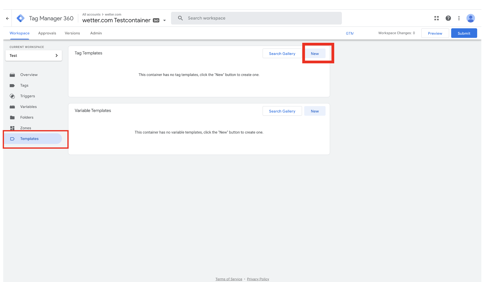
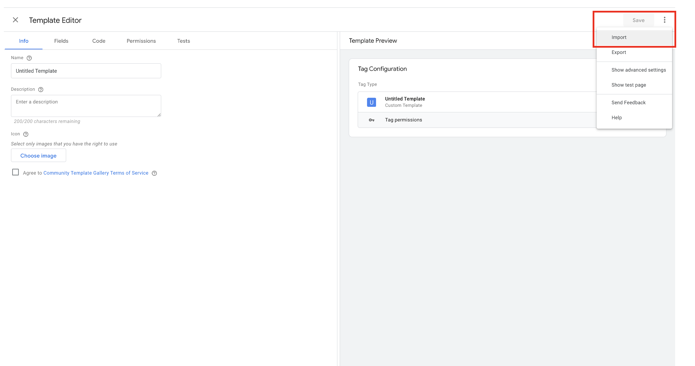
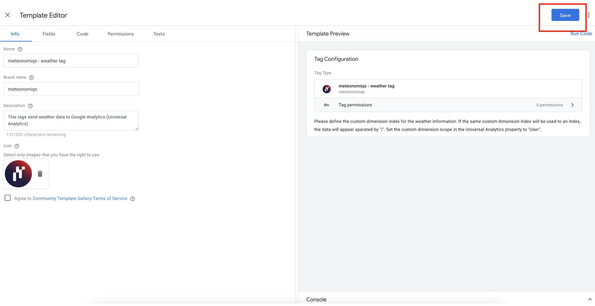
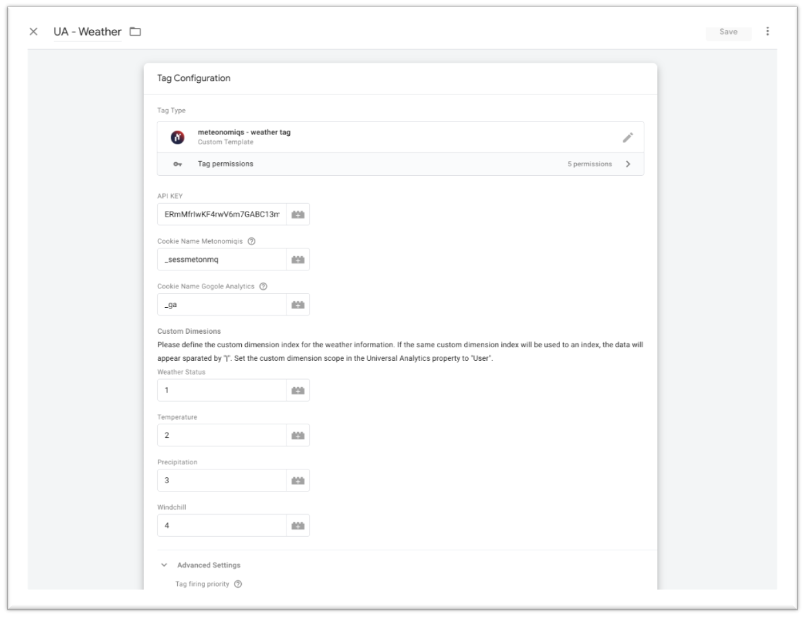

# Google Analytics Weather Tag Template

## Features 

The `meteonomiqs - weather tag` allows you to enrich your Google Analytics user sessions 
with the user's local weather conditions!

## Setup

###  Step 1: Register at meteonomiqs.com

To use the Meteonomiqs Weather Tag*, a registration is required at https://www.meteonomiqs.com/de/wetter-analytics/

### Step 2: import tag from gallery

Open your Google Tag manager account and click on `Templates`

Select the `meteonomiqs - weather tag` from the solution gallery.

***Note: as long as we are not available in the solution gallery, you can download the file 
[template.tpl](https://raw.githubusercontent.com/meteonomiqs/gtm-weather/main/template.tpl)
from this repository manually and upload it into the Google Tag Manager:***

### Step 3: Configure Tag

Create a new custom tag.

Fill out the following general fields
* `API_KEY`: put here the API key you have received during registration
* `Cookie Name Website`: e.g. `_sessmeteonmq`
* `Cookie Name Google Analytics`: usually `_ga`

Next, the custom dimesions fields need to be filled. Create Custom dimensions with the same Weather parameter names (Weather Status, Temperature, Precipitation , Windchill) on your Google analytics property with 'User' scope. Provide the respective custom dimenion's index on these fields.

You can assign multiple weather parameters to the same custom dimensions. In this case the values will be separated by a pipe symbol `|`

Weather parameters that are left blank will not be available in the session data later.

**NOTE: make sure only to use indices of custom dimensions that are not used elsewhere!**

Save the tag.

Finally, fire this custom tag you have created as a cleanup tag (tag sequencing) on your website's pageview tag as shown here. The tag sequencing will ensure the custom tag fires immediately after your pageview tag is fired.

## Usage

Once the tag is configured and deployed, the custom dimenions of a user session data will contain the configured the weather parameters!

You can now analyze how user behaviour is impacted by different weather conditions.

Warning: the Weather Tag by Meteonomiqs determines location based on IP address. The location data is then used to check weather conditions. IP address is not saved or processed any further. You should ensure that your website privacy policy complies with the weather tag requirement.

Go ahead an build you own weather based analysis!
