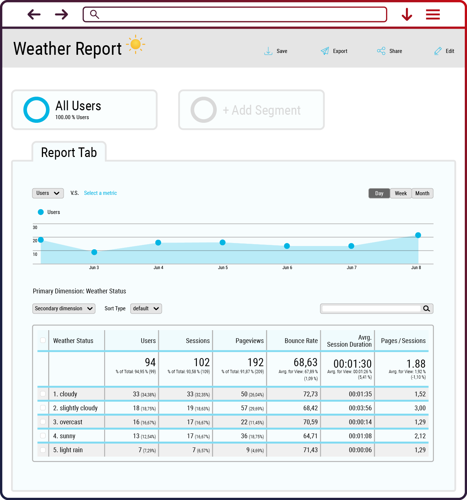

# Google Analytics Weather Tag Template

## Features 

The `meteonomiqs - weather tag` allows you to enrich your Google Analytics user sessions 
with the user's local weather conditions!

## Setup

###  Step 1: Register at meteonomiqs.com

To use the Meteonomiqs Weather Tag, a registration is required at https://www.meteonomiqs.com/de/wetter-analytics/.

### Step 2: Import Template from the Google Tag manager's community template gallery

Open your Google Tag manager account and click on `Templates`.

Click on `Search Gallery` and search for `meteonomiqs - weather tag` from the solution gallery.

Click on the template and add to workspace.

Click on add.

### Step 3: Enhance Data Privacy Statement or Configure CMP

To make sure you have consent from your users to enhance their session data, please update 
your privacy statement (Step 3a) or include wetter.com (meteonomiqs is a brand of wetter.com)
into the list of IAB vendors of your CMP (Step 3b).

**NOTE: The weather tag requires consent for Google Analytics and Google Tag Managager in order to work!**

#### Step 3a: Enhance Data Privacy Statement

You need to extend your data privacy statement using a text such as follows:

> Wir nutzen auf unserer Seite den Weathertag von METEONOMIQS. 
> Hierzu wird anhand der IP Adresse Ihr ungefährer Standort ermittelt. 
> Anhand dieser Standortdaten erfolgt dann eine Wetterabfrage bei https://wetter.com. 
> Eine Speicherung oder weitere Verarbeitung Ihrer IP Adresse findet nicht statt.
> Weitere Informationen zum WeatherTag finden Sie unter: https://www.meteonomiqs.com/de/wetter-analytics/

**NOTE: Eine Rechtsberatung dürfen wir aus gesetzlichen Gründen allerdings nicht geben, weshalb wir Ihnen keinen genauen Satz für Ihre Datenschutzbestimmungen liefern können. Bitte nutzen Sie Ihren eigenen Text in Abstimmung mit Ihrem Datenschutzbeauftragten**

**NOTE: For legal reason we are not allowed to do legal consulting, so please use your own text approved by your data privacy officer.**

#### Step 3b: CMP configuration

Add wetter.com Gmbh (IAB vendor id 1001, https://iabeurope.eu/vendor-list-tcf-v2-0/) to the list of your IAB vendors with the following setup

* Name of processing company: **wetter.com GmbH**
* Address of processing company: **Reichenaustr. 19a, 78467 Konstanz**
* Data Collected (Data) : **IP Adress to localize (not stored)**
* Technologie used (Data): **- (nothing stored)**
* Distribution to third countries (Data): **within the EU**
* Policy of Procesor : **Data privacy https://www.meteonomiqs.com/data-privacy/**
* Cookie Policy Url:  **-**
* Data Protection Officer:  **datenschutz@wetter.com**
* Storage information (Storage): **at our side nothing is stored ( weatherinformation is stored by Customer Analytics)**

### Step 4: Configure Tag

Create a new custom tag. Select the template `meteonomiqs - weather tag`.

Name your tag and fill out the following fields.

* `API_KEY`: put here the API key you have received during registration
* `Cookie Name Website`: e.g. `_sessmeteonmq`
* `Cookie Name Google Analytics`: usually `_ga`

Next, the custom dimesions fields need to be filled. Create Custom dimensions with the same Weather parameter names (Weather Status, Temperature, Precipitation , Windchill) on your Google analytics property with 'User' scope. Provide the respective custom dimenion's index on these fields.

You can assign multiple weather parameters to the same custom dimensions. In this case the values will be separated by a pipe symbol `|`

Weather parameters that are left blank will not be available in the session data later.

**NOTE: make sure only to use indices of custom dimensions that are not used elsewhere!**

Scroll down to the Advanced settings. Set the tag firing option to `Once per page`.

Save the tag.

Finally, fire this custom tag you have created as a cleanup tag (tag sequencing) on your website's pageview tag as shown here. The tag sequencing will ensure the custom tag fires immediately after your pageview tag is fired.

## Usage

Once the tag is configured and deployed, the custom dimenions of a user session data will contain the configured the weather parameters!

You can now analyze how user behaviour is impacted by different weather conditions.

Warning: the Weather Tag by Meteonomiqs determines location based on IP address. The location data is then used to check weather conditions. IP address is not saved or processed any further. You should ensure that your website privacy policy complies with the weather tag requirement.

Go ahead an build you own weather based analysis!
