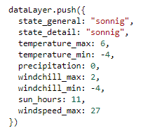
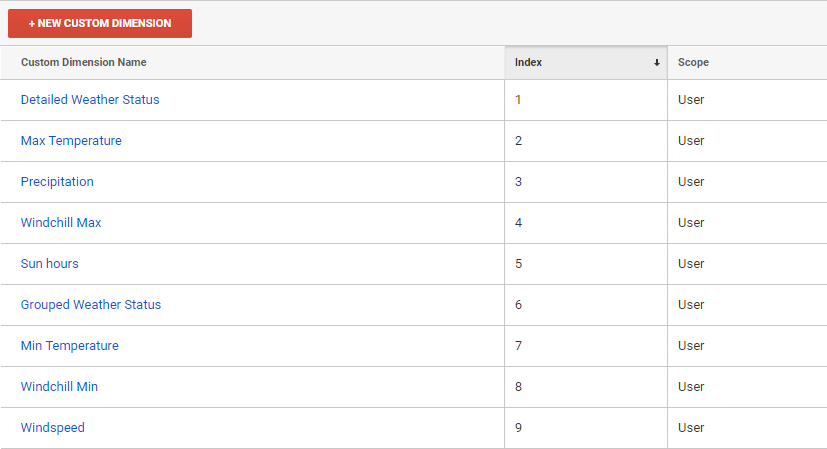
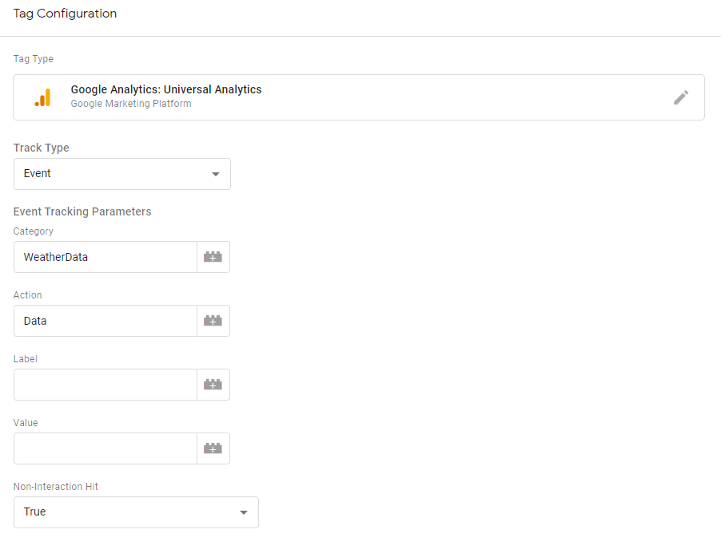
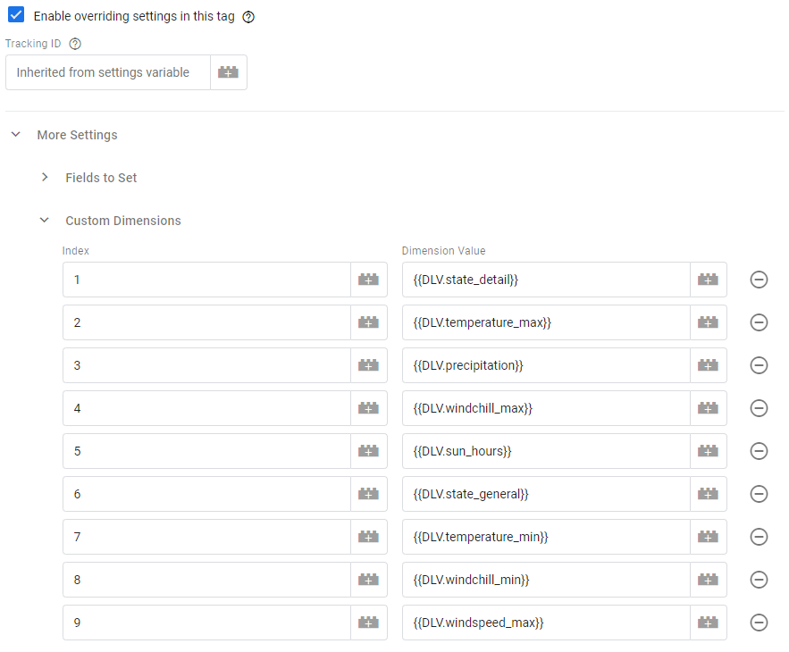

# WeatherTag4Analytics

## Features 

The `meteonomiqs - weather tag` allows you to enrich your Google Analytics user sessions 
with the user's local weather conditions! The newest Version 3.0 of the WeatherTag4Analytics is 

The version history can be found here: [VERSIONS.md]

## Setup

###  Step 1: Register at meteonomiqs.com

To use the Meteonomiqs Weather Tag, a registration is required at https://www.meteonomiqs.com/de/wetter-analytics/.

### Step 2: Import Template from the Google Tag manager's community template gallery

Open your Google Tag manager account and click on `Templates`.

Click on `Search Gallery` and search for `meteonomiqs - weather tag` from the solution gallery.

Click on the template and add to workspace.


Click on add.


Please ensure, you are using the newest version of the template. Beginning at version 3 template, the version is shown directly in the GTM Tag:


If you don't see the Version in the tag, please update your configuration to the newest tag version

### Step 3: Data Privacy Statement & CMP configuration

What we need consent for:
* We store a cookie (`_sessmetonmq`) with value `true` for 30 minutes in order to send the request not more than once per 30 minutes to the meteonomiqs backend
* From the request, the IP address is used to derive the location (latitude, longitude) for determining the weather at that location
* The weather will be sent back to the dataLayer
* IP address and location are not stored for further processing, but can be logged for troubleshooting. Logs are kept up to 10 days

An easy way is to add wetter.com Gmbh (meteonomiqs is a brand of wetter.com GmbH) as non IAB Vendor to your CMP (TCF2.0).

* Description: **The presumable location is determined based on your IP address. A weather query is then made with the location data. This weather data is transmitted to the website operator for analysis purposes. The IP address is stored in the logs to identify abuse for up to 10 days. No further processing takes place.**
* Name of processing company: **meteonomiqs.com  / wetter.com GmbH**
* Address of processing company: **Reichenaustr. 19a, 78467 Konstanz**
* Puposes: **Weather analytics**
* Data Collected: **Location based on the IP address**
* Technologies Used: **Cookies**
* Cookie URL: **-**
* Location of Processing: **European Union**
* Retention Period
  * **Cookie: 30 minutes**
  * **IP address in the log files for 10 days - the location and weather data is transmitted to the customer system, no further storage takes place on our site.**
* Policy of Procesor : **Data privacy https://www.meteonomiqs.com/data-privacy/**
* Data Protection Officer:  **datenschutz@wetter.com**
* Storage information: **Cookie (Maximum age of cookie storage: 30 minutes) is set through Weathertag but it is shown as a first Party. No Non-cookie storage**

If you are using a CMP prior to TCF2.0 or some other consent solution, please include the above information in your privacy statement as needed.

### Step 4: Create Variables

Beginning in Version 3 of the WeatherTag4Analytics, we are not sending the events directly to Google Analytics. After firing the tag, WeatherTag4Analytics will push the weatherinformation to the dataLayer:  



After pushing the information, a event will be added to the dataLayer named weatherinformation:


Go to 'Variables' on your Tag manager account and create data layer variables for both Google Analytics and wetter.com from your CMP. Name them as 'CMP.GoogleAnalytics' and 'CMP.WeatherTag', respectively. 

Create data layer variables that will contain the weather information later as shown below :

| dataLayer variable name  | 
| ------------- | 
| precipitation  | 
| state_detail  | 
| state_general  | 
| sun_hours  | 
| temperature_max  | 
| temperature_min  |
| windchill_max  |
| windchill_min  |
| windspeed_max  |

We recommend to set the name of the variable in GTM to the dataLayer variable name with the prefix DLV., e.g. DLV.temperature_min

### Step 5: Configure WeatherTag4Analytics

Create a new custom tag. Select the template `meteonomiqs - weather tag`.


Name your tag 'Weathertag - Request Weatherdata' and fill out the following fields:

* API_KEY: Add the API key you have received during registration.

* Custom Dimensions in Google Analytics: Create Custom dimensions with the same Weather parameter names (Detailed Weather Status, Grouped Weather Status, Temperature Maximum, Temperature Minimum, Precipitation, Windchill, Sun hours, Windspeed Maximum on your Google analytics property with 'User' scope. 



* Cookie Name Meteonomiqs: _sessmetonmq (this is prefilled)

Add a trigger with the name 'Weathertag Trigger - Consent' to this tag, that it fires as soon as consent for the Weathertag4Analytics is given. CMP.WeatherTag should be used as a condition in the trigger. Save the tag.

*Note: In contrast to previous version, this tag should not be a cleanup tag.*

*Remark:  If a meteonomiqs cookie is already in place (because in the browser of the user the weather data was requested within the last 30 minutes), the tag will fire but do not send a request.*

### Step 6: Send data to Google Analytics

Create a event tag 'Weathertag - Fill Datalayer' for Google Analytics and add a Event Category, Event Action and (optional) an Event Label (optional). Ensure that 'Non-Interaction Hit' is True to avoid creating users without sessions.  



In the section "Custom Dimensions", please map the custom dimension indexes to the dataLayer variables: 

*If you don't see the option for adding Custom Dimensions in the Google Analytics Event Tag, please click on "Enable overriding settings in this tag", go to "More Settings" and the section "Custom Dimensions" will appear.*



Add a trigger 'Weathertag Trigger - Fill Datalayer' to fire the tag after the weatherinformation is pushed to the dataLayer and Google Analytics consent is given.


## Usage

Once the tag 'Weathertag - Request Weatherdata' and 'Weathertag - Fill Datalayer' is configured and published, the custom dimenions of a user session data will contain the configured weather parameters!

You can now analyze how user behaviour is impacted by different weather conditions.


*Remark: The Weather Tag by Meteonomiqs determines location based on IP address. The location data is then used to check weather conditions. IP address is not saved or processed any further. You should ensure that your website privacy policy complies with the weather tag requirement.*

Go ahead an build you own weather based analysis!

## FAQ - Frequently Asked Questions

### How can I check that the tag is integrated correctly?

If the tag is configured correctly, the weather information will be found in the configured custom dimensions in Google Analytics.

To troubleshoot a configuration issue, please check the following points.

#### How can I verfiy that my API key is valid?

You can send a GET request as follows:

```
curl -X GET -H 'x-api-key: <YOUR_API_KEY>' "https://wdx-gtm.meteonomiqs.com/prod/gtm/ip2weather?c=dummy&s=1"
```

If you get a respose with {"message":"Forbidden"}`, then you key is not valid. Please contact our support at info@meteonomiqs.com 


#### How can I see that the tag sends the correct requests to meteonomiqs?

You can use the debug/web view of you browser to look for network traffic to `https://wdx-gtm.meteonomiqs.com/prod/gtm/ip2weather?`.
You should find a POST request like this one:

```
https://wdx-gtm.meteonomiqs.com/prod/gtm/ip2weather?c=GA1.3.371088426.1234567890&s=1
```

### Why are there sessions without weather information?

This can be caused by the following 

* You have visitors that do not interact with you page, see question "Why is the tag sometimes not fired on first page visits?"
* You have exceed you monthly subscription plan, see question "How can I see how much of my monthly plan is already used?"

### How can I see how much of my monthly plan is already used?

This is not yet possible but will be implemented in one of the next releases. If in doubt, please contact info@meteonomiqs.com 
