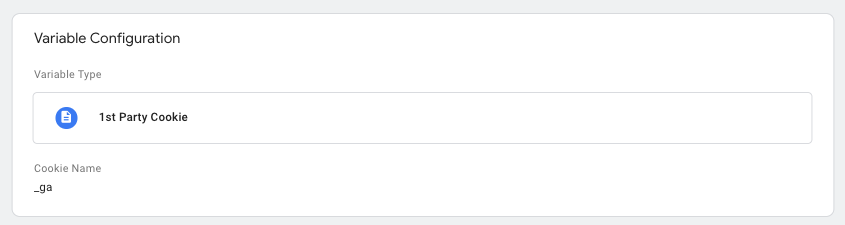

# Google Analytics Weather Tag Template

## Features 

The `meteonomiqs - weather tag` allows you to enrich your Google Analytics user sessions 
with the user's local weather conditions!

## Setup

###  Step 1: Register at meteonomiqs.com

To use the Meteonomiqs Weather Tag, a registration is required at https://www.meteonomiqs.com/de/wetter-analytics/.

### Step 2: Import Template from the Google Tag manager's community template gallery

Open your Google Tag manager account and click on `Templates`.

Click on `Search Gallery` and search for `meteonomiqs - weather tag` from the solution gallery.

Click on the template and add to workspace.


Click on add.


### Step 3: Data Privacy Statement & CMP configuration

What we need consent for:
* We store a cookie (`_sessmetonmq`) with value `true` for 30 minutes in order to send the request not more than once per 30 minutes to the meteonomiqs backend
* The request that is sent to the meteonomiqs backend includes the Google client id from the Google Analytics cookie `_ga`
* From the request, the IP address is used to derive the location (latitude, longitude) for determining the weather at that location
* The Google client id together with the weather data is sent to Google analyics
* IP address and location are not stored for further processing, but can be logged for troubleshooting. Logs are kept up to 10 days

An easy way is to add wetter.com Gmbh (meteonomiqs is a brand of wetter.com GmbH) as non IAB Vendor to your CMP (TCF2.0).

* Description: **The presumable location is determined based on your IP address. A weather query is then made with the location data. This weather data is transmitted to the website operator for analysis purposes. The IP address is stored in the logs to identify abuse for up to 10 days. No further processing takes place.**
* Name of processing company: **meteonomiqs.com  / wetter.com GmbH**
* Address of processing company: **Reichenaustr. 19a, 78467 Konstanz**
* Puposes: **Weather analytics**
* Data Collected: **Location based on the IP address**
* Technologies Used: **Cookies**
* Cookie URL: **-**
* Location of Processing: **European Union**
* Retention Period
  * **Cookie: 30 minutes**
  * **IP address in the log files for 10 days - the location and weather data is transmitted to the customer system, no further storage takes place on our site.**
* Policy of Procesor : **Data privacy https://www.meteonomiqs.com/data-privacy/**
* Data Protection Officer:  **datenschutz@wetter.com**
* Storage information: **Cookie (Maximum age of cookie storage: 30 minutes) is set through Weathertag but it is shown as a first Party. No Non-cookie storage**

If you are using a CMP prior to TCF2.0 or some other consent solution, please include the above information in your privacy statement as needed.

### Step 4: Configure Tag

Create a new custom tag. Select the template `meteonomiqs - weather tag`.


Name your tag (For example, 'UA-Weather') and fill out the following fields.

* API_KEY: Add the API key you have received during registration
* Cookie Name Website: _sessmetonmq (this is prefilled)
* Cookie Name Google Analytics: _ga (this is prefilled)
* Custom Dimensions: Create Custom dimensions with the same Weather parameter names (Weather Status, Temperature, Precipitation, Windchill) on your Google analytics property with 'User' scope. Provide the respective custom dimenion's index on these fields.


You can assign multiple weather parameters to the same custom dimensions. In this case, the values will be separated by a pipe symbol `|`. Weather parameters that are left blank will not be available in the session data later. Make sure you do not reuse the custom dimenion indexes.

Scroll down to the Advanced settings. Set the tag firing option to `Once per page`.


Save the tag. Go to 'Variables' on your Tag manager account and create 'Data Layer Variables' for both Google Analytics and wetter.com from your CMP, if not created already.


In addition to that, create a 'First Party Cookie Variable' as shown below. Provide the cookie name as _ga.



Now, go back to the custom tag (UA-Weather) we created and add a trigger for checking the consents. Click on Triggering. Click on + at the top right corner to add a new trigger. Choose the custom event trigger.


Check consent for both Google Analytics & wetter.com using the variables we created above. In addition to that, check if the first party cookie variable has value on it. This condition ensures that the GA cookie is set before the weather tag is fired. By doing this, we reduce the risk of sending empty values to the meteonomiqs backend. Your trigger should look like below.


Note: If you don't have CMP in place, the trigger for checking the consent can be ignored. Simply add this custom tag you have created (without any trigger) as a cleanup tag (Tag sequencing) on your website's generic pageview tag as shown here. The tag sequencing will ensure the custom tag fires immediately after your pageview tag is fired.


## Usage

Once the tag is configured and deployed, the custom dimenions of a user session data will contain the configured weather parameters!

You can now analyze how user behaviour is impacted by different weather conditions.


Warning: The Weather Tag by Meteonomiqs determines location based on IP address. The location data is then used to check weather conditions. IP address is not saved or processed any further. You should ensure that your website privacy policy complies with the weather tag requirement.

Go ahead an build you own weather based analysis!

## FAQ - Frequently Asked Questions

### How can I check that the tag is integrated correctly?

If the tag is configured correctly, the weather information will be found in the configured custom dimensions in Google Analytics.

To troubleshoot a configuration issue, please check the following points

#### How can I verfiy that my API key is valid?

You can send a GET request as follows:

```
curl -X GET -H 'x-api-key: <YOUR_API_KEY>' "https://wdx-gtm.meteonomiqs.com/prod/gtm/ip2weather?c=dummy&s=1"
```

If you get a respose with {"message":"Forbidden"}`, then you key is not valid. Please contact our support at {TODO: support mail}


#### How can I check that the correct Goolge UA ID is used?

You have provided the UA ID during registration. You can check it using you API key:

You can send a GET request as follows:

```
curl -X GET -H 'x-api-key: <YOUR_API_KEY>' "https://wdx-gtm.meteonomiqs.com/prod/gtm/ip2weather?c=dummy&s=1"
```

The response will contain the masked Google UA-ID in the field `"google_uid"`, e.g. "google_uid": "UA-59xxxxxxxx"`

#### How can I see that the tag sends the correct requests to meteonomiqs?

You can use the debug/web view of you browser to look for network traffic to `https://wdx-gtm.meteonomiqs.com/prod/gtm/ip2weather?`.
You should find a POST request like this one:

```
https://wdx-gtm.meteonomiqs.com/prod/gtm/ip2weather?c=GA1.3.371088426.1234567890&s=1
```

The parameter c must contain a valid GA session ID. It must be followed by at least one paramter with a value of the custom dimensions you have configured.

### Why is the tag sometimes not fired on first page visits?

In order to combine the weather information with a Google Analytics session, the tag should be fired after the first Google Analytics pageview tag is fired. In order to check the tag execution status, tick the box "Push status of tag execution to dataLayer" in the tag and create a dataLayer variable "mtqfired". This variable is updated everytime the tag is requesting weather information along the event name "gaweather".


If the tag was fired successfully, the value is yes. If the value is no, the tag needs to be fired again.

### What kind of values is expected for weather information boxes in the tag


Please fill in the custom dimension index 1 -20 or 1-200 (GA360). 


### Why are there sessions without weather information?

This can be caused by the following 

* You have visitors that do not interact with you page, see question "Why is the tag sometimes not fired on first page visits?"
* You have exceed you monthly subscription plan, see question "How can I see how much of my monthly plan is already used?"

### How can I see how much of my monthly plan is already used?

This is not yet possible but will be implemented in one of the next releases. If in doubt, please contact {TODO: support mail}
