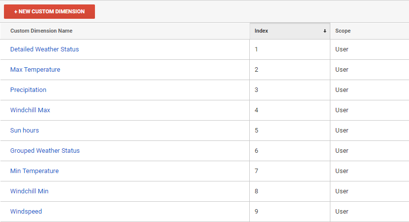
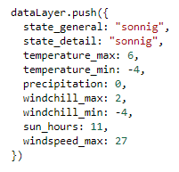
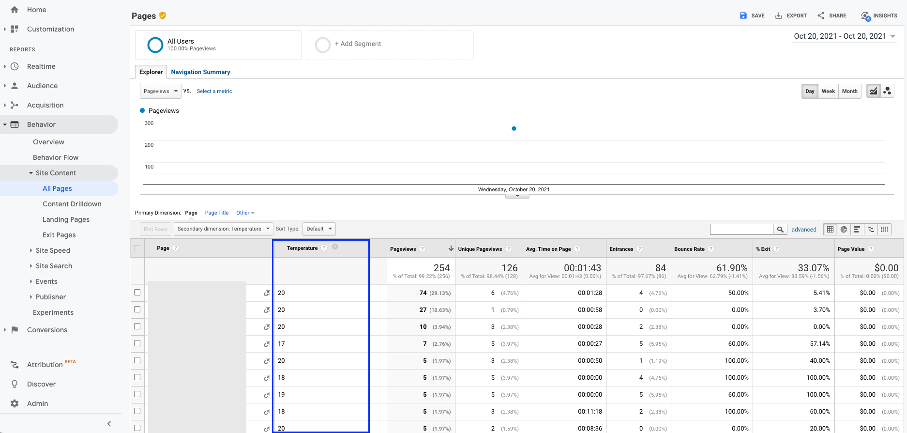

# Update to Version 3

The entire update can be done within 15 minutes.

###  Step 1: Go to your Google Tagmanager

Navigate to the section 'Templates', there you find the option to update the template:

### Step 2: Accept the changes

After reviewing the changes of the Meteonomiqs Weather Tag (optional) you accept them.

### Step 3: Check update

Now you can check the actual version of the tag directly in tag.

### Step 4: Additional updates

Due to major technical changes, steps 5 and 6 of the setup in has to be done. In particular, the new custom dimensions for the additional weather parameter has to added, the datalayer variables has to be created and these variables have to be linked. Note that from Version 3 on the Weather Tag is no clean-up tag anymore.

### Step 5: Create Variables

First extend the custom dimensions on your Google analytics property with 'User' scope with the weather parameter names: Detailed Weather Status, Grouped Weather Status, Temperature Maximum, Temperature Minimum, Precipitation, Windchill, Sun hours, Windspeed Maximum. 

*Remark: Beginning in Version 3 of the WeatherTag4Analytics, we are not sending the events directly to Google Analytics. After firing the tag, WeatherTag4Analytics will push the weatherinformation to the dataLayer:*

*After pushing the information, an event will be added to the dataLayer named weatherinformation:*

 

Second, in your Google Tagmanager account create data layer variables that will contain the weather information as shown below:

| dataLayer variable name  | 
| ------------- | 
| precipitation  | 
| state_detail  | 
| state_general  | 
| sun_hours  | 
| temperature_max  | 
| temperature_min  |
| windchill_max  |
| windchill_min  |
| windspeed_max  |

Third, set the names of the variable in Google Tag Manager equal to the dataLayer variable names, but with the prefix DLV., e.g. DLV.temperature_min

### Step 6: Send data to Google Analytics

Create a event tag 'Weathertag - Fill Datalayer' for Google Analytics and add Event Category, Event Action (optional) and Event Label (optional). Ensure that 'Non-Interaction Hit' is True to avoid creating users without sessions.  

In the section "Custom Dimensions", please map the custom dimension indexes to the dataLayer variables: 

*If you don't see the option for adding Custom Dimensions in the Google Analytics Event Tag, please click on "Enable overriding settings in this tag", go to "More Settings" and the section "Custom Dimensions" will appear.*

Add a trigger 'Weathertag Trigger - Fill Datalayer' to fire the tag after the weatherinformation is pushed to the dataLayer and Google Analytics consent is given.

In case you do not have a CMP, just select 'All Custom Events' instead of 'Some Custom Event' and ignore the CMP.Google Analytics condition in 'Weathertag Trigger - Fill Datalayer'. 

## Usage

Once the tag 'Weathertag - Request Weatherdata' and 'Weathertag - Fill Datalayer' is configured and published, the custom dimenions of a user session data will contain the configured weather parameters!

You can now analyze how user behaviour is impacted by different weather conditions.

